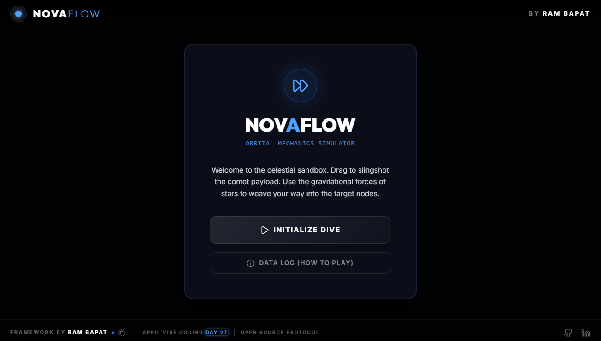
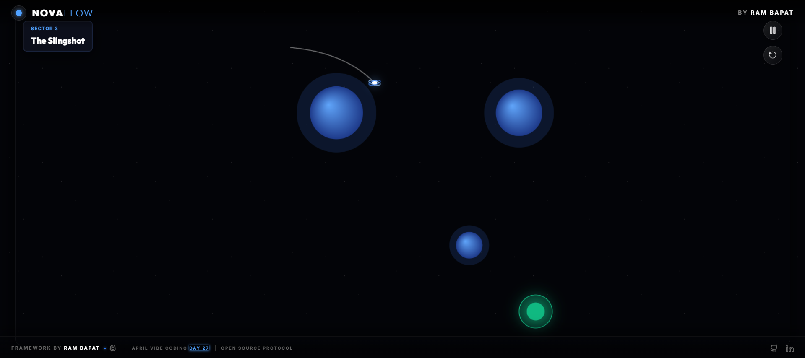
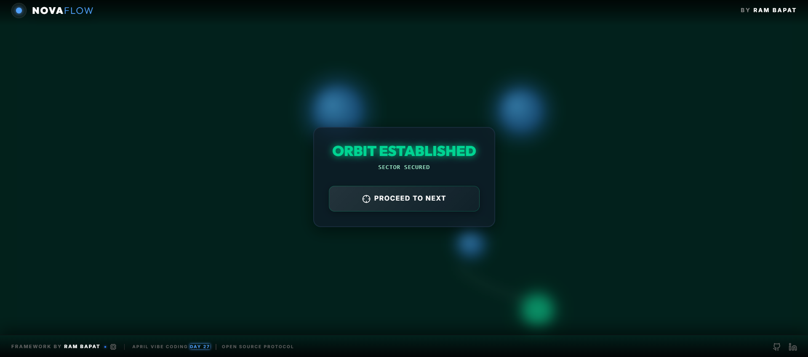
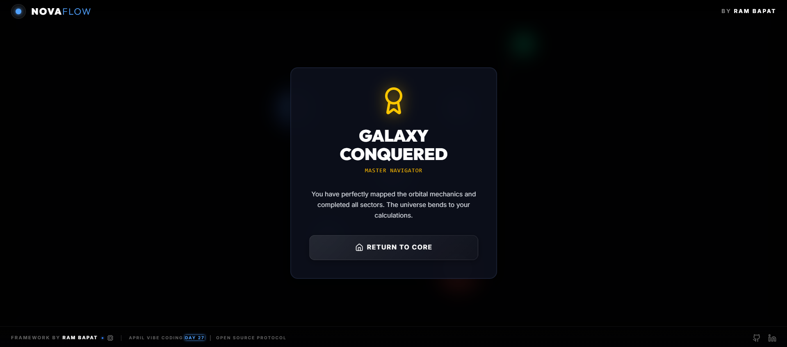

# 🌌 NovaFlow

    

**Day 27 / 30 - April Vibe Coding Challenge**

## 🔗 [Live Demo](#)

**NovaFlow** is an ultra-premium, interactive orbital mechanics and gravity puzzle simulator. Navigate the deep celestial void by slingshotting a glowing comet payload around massive attractive and repulsive celestial bodies. Chart the perfect trajectory to securely lock into the target orbit without crashing.

## 📸 Screenshots

*(Add your screenshots here)*





## ✨ Features

*   **🪐 Orbital Physics Engine:** Fully custom-built 60fps physics simulation engine written raw in React and HTML5 Canvas. It accurately simulates gravitational fields, acceleration arcs, and orbital momentum based on `F = G * (m1 * m2) / r^2`.
*   **🎯 Predictive Raycast Aiming:** When pulling back to aim, the engine calculates 120 steps into the future, dynamically drawing a dashed trajectory line showing exactly how gravity curves your shot before you even launch.
*   **☄️ Glowing Particle Decay:** As the comet flies, it leaves a perfectly smooth trailing motion-blur effect by manipulating canvas opacity decay, accompanied by glowing particle explosions on impact.
*   **🎨 Deep Space Aesthetics:** Designed with absolute premium, deep space glassmorphism. Uses pure blacks (`#030408`) contrasted with striking neon blues, emeralds, and crimson planets enveloped in glowing radiuses.
*   **✨ Universal Scaling:** Built upon a dynamic `ResizeObserver`-styled coordinate mapping protocol, ensuring the massive 1000x1000 coordinate plane fits universally across any sized viewport without ever stretching or distorting.

## 🛠️ Tech Stack

*   **Frontend Framework:** React 19 + TypeScript
*   **Physics Rendering:** HTML5 Canvas Context 2D
*   **Build Tool:** Vite
*   **Styling:** Tailwind CSS 4 (Premium Glassmorphic Theme)
*   **Animations:** Framer Motion (`motion/react`)
*   **Typography:** `Outfit` (Display) + `Inter` (UI)

## 🚀 Getting Started

### 1. Clone the Repository
```bash
git clone https://github.com/Barrsum/NovaFlow-Gravity-Puzzle.git
cd NovaFlow-Gravity-Puzzle
```

### 2. Install Dependencies
```bash
npm install
```

### 3. Run the App
```bash
npm run dev
```

## 👤 Author

**Ram Bapat**
*   [LinkedIn](https://www.linkedin.com/in/ram-bapat-barrsum-diamos)
*   [GitHub](https://github.com/Barrsum)

---
*Part of the April 2026 Vibe Coding Challenge.*
